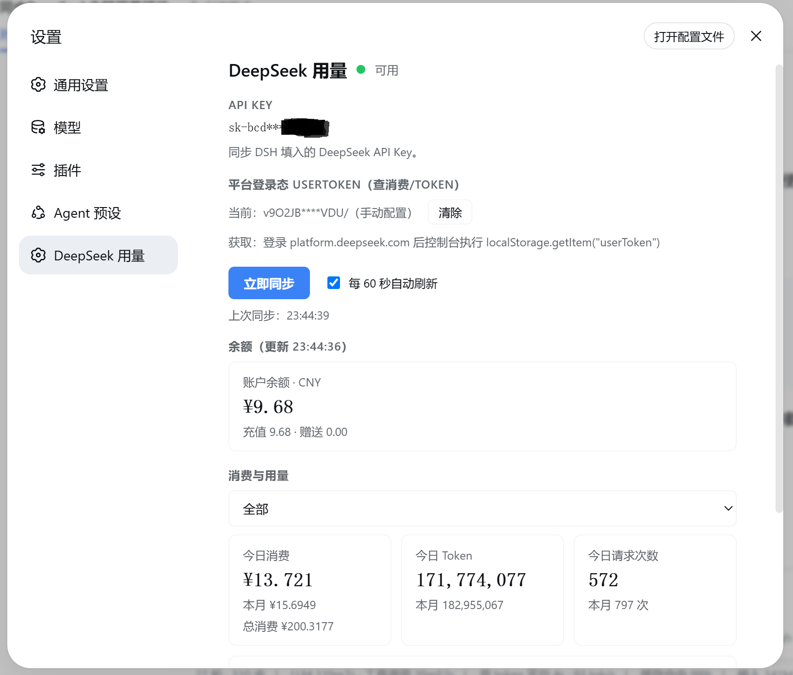
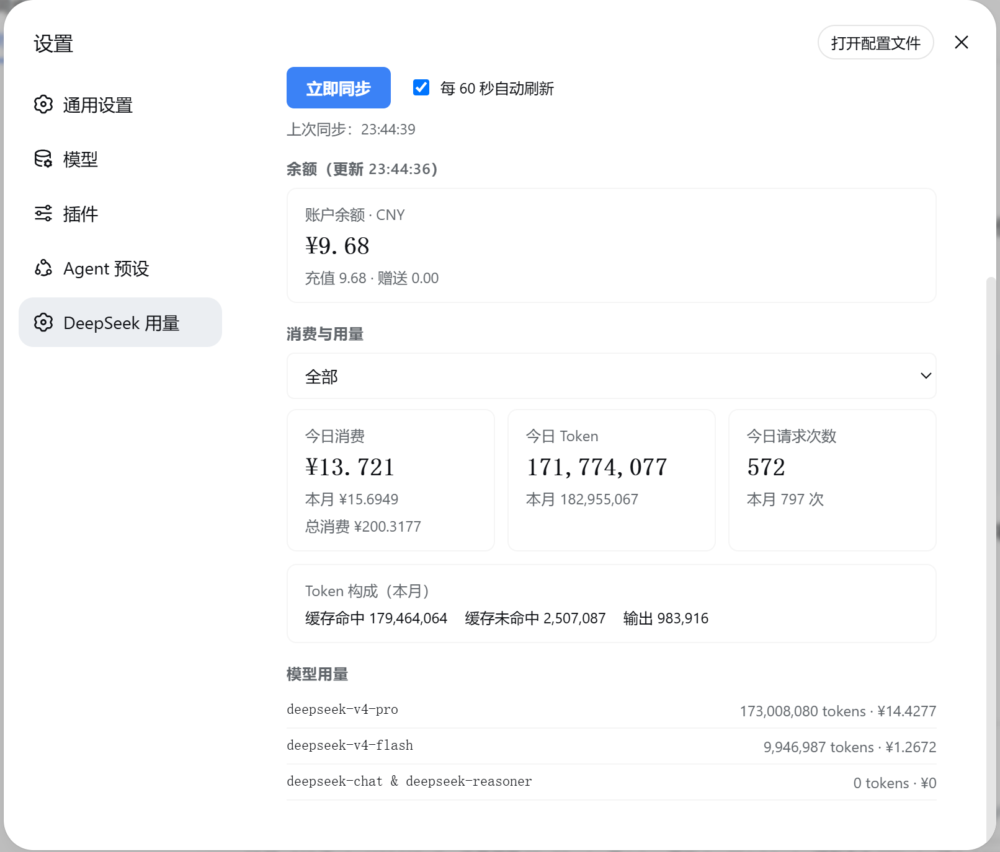

<h1 align="center">dsh-deepseek-usage</h1>
<p align="center">在 DSH 设置页查看 DeepSeek 余额与用量。</p>

## 功能

| 功能        | 说明                                                               |
| --------- | ---------------------------------------------------------------- |
| 账户余额      | 官方 `GET /user/balance`，多币种（总余额 / 充值 / 赠送）+ 可用状态灯（绿/黄/红/灰）        |
| 用量统计      | 今日 / 本月 token、消费、请求次数（今日按北京时间 0 点起算），以及缓存命中 / 未命中 / 输出的 token 构成 |
| 分模型拆分     | 每个模型的 token 用量与消费                                                |
| 分 API Key | 按 `api_key_name` 筛选单个 key 的用量（对应官方页面的「按 API 筛选」）                 |
| 总消费       | 全部历史累计消费（逐月汇总）                                                   |
| 自动刷新      | 可勾选「每 60 秒自动刷新」，偏好持久化                                            |

## 截图





## 细节说明

### 数据来源

| 数据        | 接口                                                             | 认证            |
| --------- | -------------------------------------------------------------- | ------------- |
| 余额        | `api.deepseek.com/user/balance`（官方公开）                          | API Key       |
| 本月用量 / 消费 | `platform.deepseek.com/api/v0/usage/amount`、`usage/cost`（网页接口） | 登录态 userToken |
| 今日用量 / 消费 | `platform.deepseek.com/api/v0/usage/export`（北京时间窗口）            | 登录态 userToken |

> 今日按北京时间（本地时区）0 点起算：平台月接口按 UTC 切分日数据，今日口径按 `usage/export` 窗口统计。

> 用量 / 消费接口是 platform.deepseek.com 的私有接口，非官方公开 API，可能随时变更。

### 凭据

| 凭据        | 存放                                         | 说明            |
| --------- | ------------------------------------------ | ------------- |
| API Key   | DSH 凭据服务 `DEEPSEEK_API_KEY`（与调用 LLM 共用，只读） | 在 DSH 模型设置中更改 |
| userToken | DSH 凭据服务 `DEEPSEEK_USER_TOKEN`          | 由用户手动粘贴，不读取浏览器数据 |

## 安全设计

- 凭据服务端保存：API Key 和 userToken 都走 DSH 凭据服务；手动输入的 Token 会通过设置页的一次性请求提交到本地 DSH 服务，插件不会读取浏览器数据库。
- Node 原生 `fetch` 直连：无 shell / 子进程中间层，凭据只在进程内存流转。
- 回环 + 同源守卫：所有路由仅接受 127.0.0.1 回环与同源请求，内置 DNS-rebinding 防护；这不是对同机其他进程的独立认证。
- 稳定错误码 + 最小日志：日志只记录 `{code, status}`。

## 安装

正式使用（从 GitHub 安装）：

```bash
dsh plugin --profile web add github:AzureHalcyon/dsh-deepseek-usage#main
```

本地开发（link 安装）：

```bash
dsh plugin --profile web add link:<本仓库绝对路径>
```

装完重启 DSH。

## 使用

1. 打开 **设置 → DeepSeek 用量**；
2. API Key 自动复用 DSH 的 `DEEPSEEK_API_KEY`（只读展示，无需额外配置）；
3. 登录 DeepSeek 开放平台后，在浏览器控制台执行 `localStorage.getItem("userToken")`，将结果手动粘贴到插件中；插件不会扫描浏览器数据；
4. 点「立即同步」。

## 插件管理

已装插件建议用 plugin-registry 的薄控制台管理（浏览器面板）：管理 profile 插件安装态（bundle 层栈 + insert 行 + 启停），无需手改配置。安装：

```bash
dsh plugin --profile web add "github:vlln/plugin-registry#main&path:/packages/plugin/console"
```
